# DataFlow AI 🚀

<div align="center"> 

[](https://opensource.org/licenses/MIT)
[](https://nextjs.org/)
[](https://reactjs.org/)
[](https://fastapi.tiangolo.com/)
[](https://www.python.org/)

**Transform raw data into actionable insights with AI-powered analytics**

[🚀 Live Demo]([https://drive.google.com/file/d/1V-xpuKjwUmFVJF5T7AZ0YfIrS4IuLRXy/view?usp=sharing]) • [📖 Documentation](https://github.com/WasifSohail5/DataFlow-AI) • [🐛 Report Bug](https://github.com/WasifSohail5/DataFlow-AI/issues)

</div>

---

## 🌟 Overview

**DataFlow AI** is an enterprise-grade data analysis and visualization platform that empowers businesses and data professionals to make data-driven decisions faster. Leverage the power of artificial intelligence to automatically generate insights, create stunning visualizations, and interact with your data through natural language.

<div align="center">
  
</div>

---

## ✨ Key Features

<table>
<tr>
<td width="50%">

### 📊 Smart Visualizations
- **Automatic Chart Generation** - AI selects the best visualization for your data
- **Interactive Dashboards** - Drill down into your data with dynamic filters
- **Multiple Chart Types** - Line, Bar, Scatter, Heatmap, and more
- **Export Options** - Save as PNG, SVG, or PDF

</td>
<td width="50%">

### 🤖 AI-Powered Chatbot
- **Natural Language Queries** - Ask questions in plain English
- **Instant Insights** - Get statistical summaries on demand
- **Code Generation** - Generate Python/SQL code for analysis
- **Context-Aware** - Understands your data structure

</td>
</tr>
<tr>
<td width="50%">

### 📈 Advanced Analytics
- **Correlation Analysis** - Discover relationships in your data
- **Statistical Testing** - Hypothesis testing and p-values
- **Outlier Detection** - Identify anomalies automatically
- **Time Series Analysis** - Trend detection and forecasting

</td>
<td width="50%">

### 🎨 Modern Interface
- **Responsive Design** - Works on desktop, tablet, and mobile
- **Dark/Light Themes** - Comfortable viewing in any environment
- **Drag & Drop** - Easy file uploads
- **Real-time Updates** - See changes instantly

</td>
</tr>
</table>

---

## 🛠️ Technology Stack

<div align="center">

### Frontend


### Backend


</div>

---

## 🚀 Quick Start

### Prerequisites

Before you begin, ensure you have the following installed:
- **Node.js** (v16 or higher) - [Download](https://nodejs.org/)
- **Python** (v3.9 or higher) - [Download](https://www.python.org/)
- **npm** or **yarn** package manager

### Installation

#### 1️⃣ Clone the Repository
```bash
git clone https://github.com/WasifSohail5/DataFlow-AI.git
cd DataFlow-AI
```

#### 2️⃣ Frontend Setup
```bash
# Install dependencies
npm install
# or
yarn install

# Create environment file
cp .env.example .env.local

# Configure your environment variables
# Edit .env.local with your API keys and configuration
```

#### 3️⃣ Backend Setup
```bash
# Navigate to backend directory
cd backend

# Create virtual environment
python -m venv .venv

# Activate virtual environment
# On Windows:
.venv\Scripts\activate
# On macOS/Linux:
source .venv/bin/activate

# Install Python dependencies
pip install -r requirements.txt
```

### Running the Application

#### Start Backend Server 🔧
```bash
cd backend
uvicorn main:app --host 0.0.0.0 --port 8004 --reload
```
Backend will be available at `http://localhost:8004`

#### Start Frontend Server 🎨
```bash
# In a new terminal window
npm run dev
# or
yarn dev
```
Frontend will be available at `http://localhost:3000`

---

## 📋 Core Modules

### 🎯 Report Generator
Transform your data into professional reports with:
- Automated visualization generation based on data types
- Statistical analysis summaries (mean, median, mode, std dev)
- Export functionality (PDF, HTML, Excel)
- Customizable report templates
- Schedule automated reports

### 🔬 Data Science Toolkit
Advanced analytics at your fingertips:
- **Descriptive Statistics** - Comprehensive data summaries
- **Correlation Matrix** - Identify relationships between variables
- **Distribution Analysis** - Understand data spread and patterns
- **Outlier Detection** - Flag unusual data points
- **Missing Data Analysis** - Identify and handle missing values
- **Feature Engineering** - Create new derived features

### 💬 AI Assistant
Your intelligent data analyst:
- Natural language understanding
- Context-aware responses
- Query suggestions based on your data
- Export conversation history
- Multi-language support
- Custom prompt engineering

---

## 📸 Screenshots & Visualizations

<div align="center">

### 🏠 Dashboard Overview


### 📊 Data Visualization Examples

<table>
<tr>
<td width="50%">

</td>
<td width="50%">

</td>
</tr>
<tr>
<td width="50%">

</td>
<td width="50%">

</td>
</tr>
</table>

### 🤖 AI Chat Interface


### 📈 Analytics Dashboard


</div>

---

## 🔄 Typical Workflow

```mermaid
graph LR
    A[📁 Upload Data] --> B[🔍 Auto Analysis]
    B --> C[📊 Generate Visualizations]
    C --> D[💬 Ask AI Questions]
    D --> E[📈 Explore Insights]
    E --> F[📄 Export Reports]
    F --> G[✅ Share Results]
```



1. **📁 Upload Your Data** - Support for CSV, Excel, JSON, and SQL databases
2. **🔍 Automatic Analysis** - AI analyzes your data structure and suggests visualizations
3. **📊 Create Visualizations** - Generate charts with a single click
4. **💬 Interact with AI** - Ask questions and get instant answers
5. **📈 Discover Insights** - Explore patterns, trends, and anomalies
6. **📄 Generate Reports** - Create professional reports with your findings
7. **✅ Share & Collaborate** - Export and share with your team

---

## 🎯 Use Cases

- **📊 Business Intelligence** - Track KPIs and business metrics
- **🔬 Research & Academia** - Analyze experimental data
- **💰 Financial Analysis** - Portfolio analysis and risk assessment
- **📈 Marketing Analytics** - Campaign performance and customer insights
- **🏥 Healthcare** - Patient data analysis and trends
- **🌐 E-commerce** - Sales trends and customer behavior

---

## 🤝 Contributing

Contributions are what make the open-source community such an amazing place to learn, inspire, and create. Any contributions you make are **greatly appreciated**.

### How to Contribute

1. **Fork** the repository
2. Create your **Feature Branch** (`git checkout -b feature/AmazingFeature`)
3. **Commit** your changes (`git commit -m 'Add some AmazingFeature'`)
4. **Push** to the branch (`git push origin feature/AmazingFeature`)
5. Open a **Pull Request**

### Development Guidelines

- Follow existing code style and conventions
- Write clear commit messages
- Add tests for new features
- Update documentation as needed
- Ensure all tests pass before submitting PR

---

## 📄 License

This project is licensed under the **MIT License** - see the [LICENSE](LICENSE) file for details.

---

## 👨‍�� Author

<div align="center">

### Wasif Sohail

[](https://github.com/Wasif-Sohail55)
[](https://linkedin.com/in/wasif-sohail)
[](https://your-portfolio.com)

</div>

---

## 🙏 Acknowledgements

Special thanks to these amazing projects and resources:

- [Next.js](https://nextjs.org/) - The React Framework for Production
- [FastAPI](https://fastapi.tiangolo.com/) - Modern Python Web Framework
- [React](https://reactjs.org/) - JavaScript Library for Building UIs
- [Tailwind CSS](https://tailwindcss.com/) - Utility-First CSS Framework
- [Pandas](https://pandas.pydata.org/) - Python Data Analysis Library
- [Matplotlib](https://matplotlib.org/) & [Seaborn](https://seaborn.pydata.org/) - Data Visualization

---

## 📞 Support

If you have any questions or need help getting started, feel free to:

- 📧 **Email**: wasifsohail66@example.com
- 💬 **Discussions**: [GitHub Discussions](https://github.com/WasifSohail5/DataFlow-AI/discussions)
- 🐛 **Issues**: [Report a Bug](https://github.com/WasifSohail5/DataFlow-AI/issues)

---

<div align="center">

### ⭐ Star this repository if you find it helpful!

**Built with ❤️ by Wasif Sohail**


</div>
